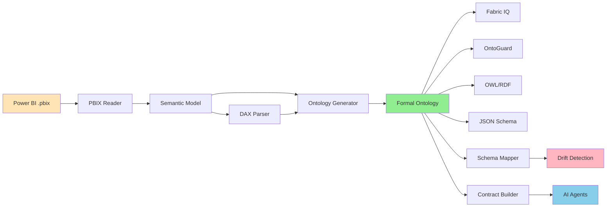

# PowerBI Ontology Extractor

<div align="center">


**Transform 20 million Power BI dashboards into AI-ready ontologies**

[](https://github.com/cloudbadal007/powerbi-ontology-extractor/actions)
[](https://codecov.io/gh/cloudbadal007/powerbi-ontology-extractor)
[](https://www.python.org/downloads/)
[](https://opensource.org/licenses/MIT)
[](https://badge.fury.io/py/powerbi-ontology-extractor)

[Installation](#installation) • [Quick Start](#-quick-start) • [Documentation](#-documentation) • [Examples](#-examples) • [Contributing](#-contributing)

</div>

---

## 🎯 The Problem

As detailed in my Medium article "[The Power BI Ontology Paradox](https://medium.com/@cloudpankaj/the-power-bi-paradox-unlocking-20-million-hidden-ontologies-for-ai-agents)", enterprises have **20+ million Power BI semantic models** that are actually **informal ontologies** trapped in proprietary .pbix files.

- **The Challenge**: Each Power BI model contains entities, relationships, and business logic—but AI agents can't access this semantic intelligence
- **The Cost**: Enterprises spend $50K-$200K per semantic definition to reconcile conflicts across dashboards
- **The Impact**: This creates billions in "semantic debt" and prevents AI agents from functioning at scale
- **The $4.6M Mistake**: A logistics company lost $4.6M when an AI agent used a renamed column (`Warehouse_Location` → `FacilityID`) because there was no semantic binding validation

## 💡 The Solution

PowerBI Ontology Extractor **unlocks the hidden ontologies** in your Power BI dashboards and transforms them into formal, AI-ready ontologies.

```python
# In 3 lines of code:
extractor = PowerBIExtractor("Supply_Chain_Operations.pbix")
ontology = extractor.extract().to_ontology()  # 70% auto-generated!
ontology.export_fabric_iq("supply_chain_ontology.json")  # Ready for AI agents
```

**What you get:**
- ✅ Extract entities, properties, and relationships from Power BI models
- ✅ Parse DAX formulas into business rules automatically
- ✅ Generate Fabric IQ ontology format for Microsoft Fabric
- ✅ Export to OntoGuard for semantic validation firewalls
- ✅ Detect schema drift (prevents the $4.6M mistake!)
- ✅ Calculate semantic debt across multiple dashboards
- ✅ Create semantic contracts for AI agents

## 🚀 Quick Start

### Installation

```bash
pip install powerbi-ontology-extractor
```

Or install from source:

```bash
git clone https://github.com/cloudbadal007/powerbi-ontology-extractor.git
cd powerbi-ontology-extractor
pip install -e .
```

### Basic Usage

```python
from powerbi_ontology import PowerBIExtractor, OntologyGenerator

# Step 1: Extract semantic model from Power BI
extractor = PowerBIExtractor("path/to/your/dashboard.pbix")
semantic_model = extractor.extract()

# Step 2: Generate formal ontology
generator = OntologyGenerator(semantic_model)
ontology = generator.generate()

print(f"✅ Extracted {len(ontology.entities)} entities")
print(f"✅ Generated {len(ontology.business_rules)} business rules")

# Step 3: Export to your preferred format
from powerbi_ontology.export import FabricIQExporter, OntoGuardExporter

fabric_exporter = FabricIQExporter(ontology)
fabric_json = fabric_exporter.export()

ontoguard_exporter = OntoGuardExporter(ontology)
ontoguard_json = ontoguard_exporter.export()
```

## 📊 Real-World Example

**Scenario**: Supply chain dashboard with 500K shipments

```python
# Extract from Power BI
extractor = PowerBIExtractor("Supply_Chain_Operations.pbix")
model = extractor.extract()

# Found:
# - 5 entities (Shipment, Customer, Warehouse, IoTSensor, ComplianceRule)
# - 8 relationships 
# - 12 DAX measures (High Risk Shipments, At-Risk Revenue, etc.)

# Generate ontology
ontology = OntologyGenerator(model).generate()

# Business rules extracted automatically from DAX:
# - "High Risk" = Temperature > 25 OR Vibration > 5
# - "At-Risk Customer" = RiskScore > 80 AND has delayed shipments

# Add the missing 30% (business analyst input):
from powerbi_ontology.ontology_generator import BusinessRule

ontology.add_business_rule(BusinessRule(
    name="RerouteApproval",
    entity="Shipment",
    condition="RiskScore > 80",
    action="RerouteShipment",
    description="High-risk shipments require manager approval for rerouting"
))

# Create schema bindings (PREVENT THE $4.6M MISTAKE!)
from powerbi_ontology import SchemaMapper

mapper = SchemaMapper(ontology, data_source="azure_sql")
binding = mapper.create_binding("Shipment", "dbo.shipments")

# Validate and detect drift
current_schema = {
    "shipment_id": "GUID",
    "warehouse_location": "String",  # Critical column!
    "temperature": "Decimal"
}

drift = mapper.detect_drift(binding, current_schema)
if drift.severity == "CRITICAL":
    print(f"🚨 DRIFT DETECTED: {drift.message}")
    print("This would have caused the $4.6M mistake!")

# Export for AI agents
from powerbi_ontology.export import FabricIQExporter
import json

fabric_exporter = FabricIQExporter(ontology)
fabric_json = fabric_exporter.export()

with open("supply_chain_ontology.json", "w") as f:
    json.dump(fabric_json, f, indent=2)
```

**Result**: Your Power BI dashboard is now an AI-ready ontology!

## 🎨 Architecture



## 🔥 Key Features

### 1. Automatic Extraction
- ✅ Reads Power BI .pbix files (ZIP-based format)
- ✅ Extracts tables, columns, relationships, hierarchies
- ✅ Parses DAX measures and calculated columns
- ✅ Identifies primary keys and foreign keys
- ✅ Captures descriptions and annotations
- ✅ Extracts row-level security (RLS) rules

### 2. DAX to Business Rules
- ✅ Parses DAX formulas automatically
- ✅ Extracts conditional logic (IF, SWITCH)
- ✅ Converts CALCULATE filters to business rules
- ✅ Identifies dependencies and relationships
- ✅ Classifies measure types (aggregation, conditional, time intelligence)

### 3. Ontology Generation (70% Automated)
- ✅ Entities from tables
- ✅ Properties from columns (with data types)
- ✅ Relationships from foreign keys (with cardinality)
- ✅ Business rules from DAX measures
- ✅ Constraints from data validation
- ✅ Pattern detection (date tables, dimensions, facts)

### 4. Multi-Format Export
- ✅ **Fabric IQ**: Ready for Microsoft Fabric deployment
- ✅ **OntoGuard**: Semantic validation firewall format
- ✅ **OWL/RDF**: Standard semantic web format
- ✅ **JSON Schema**: Universal validation format

### 5. Schema Drift Detection (Prevents $4.6M Mistakes!)
- ✅ Validates schema bindings
- ✅ Detects column renames/deletions
- ✅ Alerts when data sources change
- ✅ Prevents AI agents from breaking
- ✅ Suggests fixes for detected drift

### 6. Semantic Debt Analysis
- ✅ Analyzes multiple Power BI dashboards
- ✅ Detects conflicting definitions
- ✅ Calculates reconciliation costs ($50K per conflict)
- ✅ Suggests canonical definitions
- ✅ Generates HTML consolidation reports

### 7. Semantic Contracts for AI Agents
- ✅ Define read/write/execute permissions
- ✅ Add business rules to contracts
- ✅ Create validation constraints
- ✅ Export contracts for agent deployment

### 8. Visualization
- ✅ Entity-relationship diagrams (matplotlib)
- ✅ Interactive graphs (plotly)
- ✅ Mermaid diagram export
- ✅ Export to PNG, SVG, PDF

### 9. Visual Ontology Editor (Streamlit)
- ✅ No-code UI for ontology editing
- ✅ Load from .pbix files or JSON
- ✅ Edit entities, properties, relationships
- ✅ Permission matrix (RBAC)
- ✅ Business rules with classification
- ✅ OWL preview and export
- ✅ Run: `streamlit run ontology_editor.py`

### 10. Ontology Diff & Merge
- ✅ Git-like diff between ontology versions
- ✅ Detect added/removed/modified elements
- ✅ Generate changelogs (Markdown)
- ✅ Three-way merge (base, ours, theirs)
- ✅ Conflict detection and resolution

### 11. Collaborative Review Workflow
- ✅ Comments on entities/properties/rules
- ✅ Reply and resolve threads
- ✅ Approval workflow (draft → review → approved → published)
- ✅ Audit trail of all actions
- ✅ Markdown review reports

### 12. CLI Tool for Automation
```bash
# Install CLI
pip install -e .

# Extract ontology from single .pbix file
pbix2owl extract -i dashboard.pbix -o ontology.owl --format owl

# Batch process directory of .pbix files (8 parallel workers)
pbix2owl batch -i ./dashboards/ -o ./ontologies/ -w 8 --recursive

# Analyze semantic debt across multiple ontologies
pbix2owl analyze -i ./ontologies/ -o report.md --format markdown

# Compare two ontology versions (diff)
pbix2owl diff -s v1.json -t v2.json -o changelog.md --format changelog

# Available formats: owl, json, markdown, changelog
# CLI commands: extract, batch, analyze, diff
```

## 📚 Documentation

- 📖 [Getting Started Guide](docs/getting_started.md) - Installation and quick start
- 📖 [Power BI Semantic Models Explained](docs/power_bi_semantic_models.md) - Understanding .pbix structure
- 📖 [Ontology Format Specification](docs/ontology_format.md) - Ontology structure and definitions
- 📖 [Fabric IQ Integration Guide](docs/fabric_iq_integration.md) - Exporting to Microsoft Fabric
- 📖 [Use Cases & Examples](docs/use_cases.md) - Real-world scenarios
- 📖 [API Reference](docs/api_reference.md) - Complete API documentation

## 💼 Use Cases

### 1. Supply Chain Optimization
Extract ontology from supply chain dashboards → Deploy AI agents for real-time monitoring → Prevent $4.6M mistakes with schema drift detection

### 2. Customer Risk Management
Extract customer risk definitions → Create unified ontology → Deploy AI agents with semantic contracts → Monitor risk in real-time

### 3. Financial Reconciliation
Extract financial dashboards → Detect semantic conflicts → Calculate semantic debt → Consolidate definitions → Reduce reconciliation costs

### 4. Cross-Department Consolidation
Analyze all Power BI dashboards → Identify duplicate logic → Suggest canonical definitions → Reduce semantic debt by $600K+

### 5. AI Agent Deployment
Extract ontologies → Create semantic contracts → Deploy AI agents → Monitor with OntoGuard → Prevent failures

## 🔗 Integration with Other Tools

### Microsoft Fabric IQ

```python
from powerbi_ontology.export import FabricIQExporter
import json

exporter = FabricIQExporter(ontology)
fabric_json = exporter.export()

# Save and import into Fabric workspace
with open("ontology.json", "w") as f:
    json.dump(fabric_json, f, indent=2)

# Deploy as Ontology Item to OneLake
```

### OntoGuard (Semantic Firewall)

```python
from powerbi_ontology.export import OntoGuardExporter
import json

exporter = OntoGuardExporter(ontology)
ontoguard_json = exporter.export()

# Use with github.com/cloudbadal007/ontoguard-ai
# Prevents schema drift and AI agent failures
with open("ontoguard_config.json", "w") as f:
    json.dump(ontoguard_json, f, indent=2)
```

### Universal Agent Connector (MCP)

```python
from powerbi_ontology import ContractBuilder

# Create semantic contract
contract_builder = ContractBuilder(ontology)
contract = contract_builder.build_contract(
    agent_name="SupplyChainMonitor",
    permissions={
        "read": ["Shipment", "Customer"],
        "write": {"Shipment": ["Status"]},
        "execute": ["RerouteShipment"]
    }
)

# Export contract for MCP
contract_json = contract_builder.export_contract(contract, "json")
# Use with github.com/cloudbadal007/universal-agent-connector
```

## 📖 Related Articles

This project implements the concepts from my Medium article series:

1. **[The Power BI Ontology Paradox](https://medium.com/@cloudpankaj/the-power-bi-paradox-unlocking-20-million-hidden-ontologies-for-ai-agents)** - Why Power BI models are hidden ontologies and how to unlock them
2. **[Microsoft vs Palantir: Two Paths to Enterprise Ontology](https://medium.com/@cloudpankaj/microsoft-vs-palantir-two-paths-to-enterprise-ontology-and-why-microsofts-bet-on-semantic-6e72265dce21)** - Strategic comparison of ontology approaches
3. **[OntoGuard: Building a Semantic Firewall](https://medium.com/@cloudpankaj/ontoguard-i-built-an-ontology-firewall-for-ai-agents-in-48-hours-using-cursor-ai-be4208c405e7)** - Preventing the $4.6M mistake with schema drift detection
4. **[Universal Agent Connector: MCP + Ontology](https://medium.com/@cloudpankaj/universal-agent-connector-mcp-ontology-production-ready-ai-infrastructure-0b4e35f22942)** - Production AI infrastructure with semantic contracts

## 🤝 Contributing

We welcome contributions! See [CONTRIBUTING.md](CONTRIBUTING.md) for guidelines.

**Ways to contribute:**
- 🐛 **Report bugs** via [GitHub Issues](https://github.com/cloudbadal007/powerbi-ontology-extractor/issues)
- 💡 **Suggest features** via [Feature Requests](https://github.com/cloudbadal007/powerbi-ontology-extractor/issues/new?template=feature_request.md)
- 📝 **Improve documentation** - Fix typos, add examples, clarify concepts
- 🔧 **Submit pull requests** - Fix bugs, add features, improve code
- ⭐ **Star the repository** - Help others discover this project
- 📢 **Share with your network** - Spread the word about unlocking Power BI ontologies

### Development Setup

```bash
# Clone repository
git clone https://github.com/cloudbadal007/powerbi-ontology-extractor.git
cd powerbi-ontology-extractor

# Create virtual environment
python -m venv venv
source venv/bin/activate  # On Windows: venv\Scripts\activate

# Install dependencies
pip install -r requirements.txt
pip install -r requirements-dev.txt
pip install -e .

# Run tests
pytest

# Format code
black powerbi_ontology/ tests/
isort powerbi_ontology/ tests/
```

## 🧪 Testing

```bash
# Run all tests
pytest

# Run with coverage
pytest --cov=powerbi_ontology --cov-report=html

# Run specific test file
pytest tests/test_extractor.py -v
```

## 📊 Project Status

- ✅ **Core extraction** - Fully implemented
- ✅ **DAX parsing** - Fully implemented
- ✅ **Ontology generation** - Fully implemented
- ✅ **Schema drift detection** - Fully implemented
- ✅ **Multi-format export** - Fully implemented
- ✅ **CLI tool** - Fully implemented
- ✅ **Visualization** - Fully implemented
- 🔄 **Test coverage** - In progress (aiming for >90%)
- 🔄 **Documentation** - Continuously improving

## 🙏 Acknowledgments

- Inspired by Microsoft's Fabric IQ and semantic layer approach
- Built with feedback from the enterprise AI community
- Special thanks to all contributors and early adopters
- Powered by the open-source community

## 📄 License

This project is licensed under the MIT License - see the [LICENSE](LICENSE) file for details.

## 📞 Contact & Support

- 🐛 **Issues**: [GitHub Issues](https://github.com/cloudbadal007/powerbi-ontology-extractor/issues)
- 💬 **Discussions**: [GitHub Discussions](https://github.com/cloudbadal007/powerbi-ontology-extractor/discussions)
- 📧 **Email**: cloudpankaj@example.com
- 🐦 **Twitter/X**: [@cloudpankaj](https://twitter.com/cloudpankaj)
- 💼 **LinkedIn**: [Pankaj Kumar](https://linkedin.com/in/pankaj-kumar)
- 📝 **Medium**: [@cloudpankaj](https://medium.com/@cloudpankaj)

## ⭐ Star History

[](https://star-history.com/#cloudbadal007/powerbi-ontology-extractor&Date)

---

<div align="center">

**Built with ❤️ by [Pankaj Kumar](https://github.com/cloudbadal007)**

If this project helps you unlock the hidden ontologies in your Power BI dashboards, consider [sponsoring](https://github.com/sponsors/cloudbadal007) ☕

**Star ⭐ this repo if you find it useful!**

</div>

---

## 🎯 Roadmap

- [ ] Enhanced DAX parsing for complex formulas
- [ ] Power BI Service API integration
- [ ] Real-time ontology updates
- [ ] GraphQL endpoint for ontologies
- [ ] Visual ontology editor
- [ ] Automated testing with sample .pbix files
- [ ] Performance optimizations for large models
- [ ] Multi-language support

---

**Ready to unlock the semantic intelligence in your Power BI dashboards?** 🚀

```bash
pip install powerbi-ontology-extractor
```
